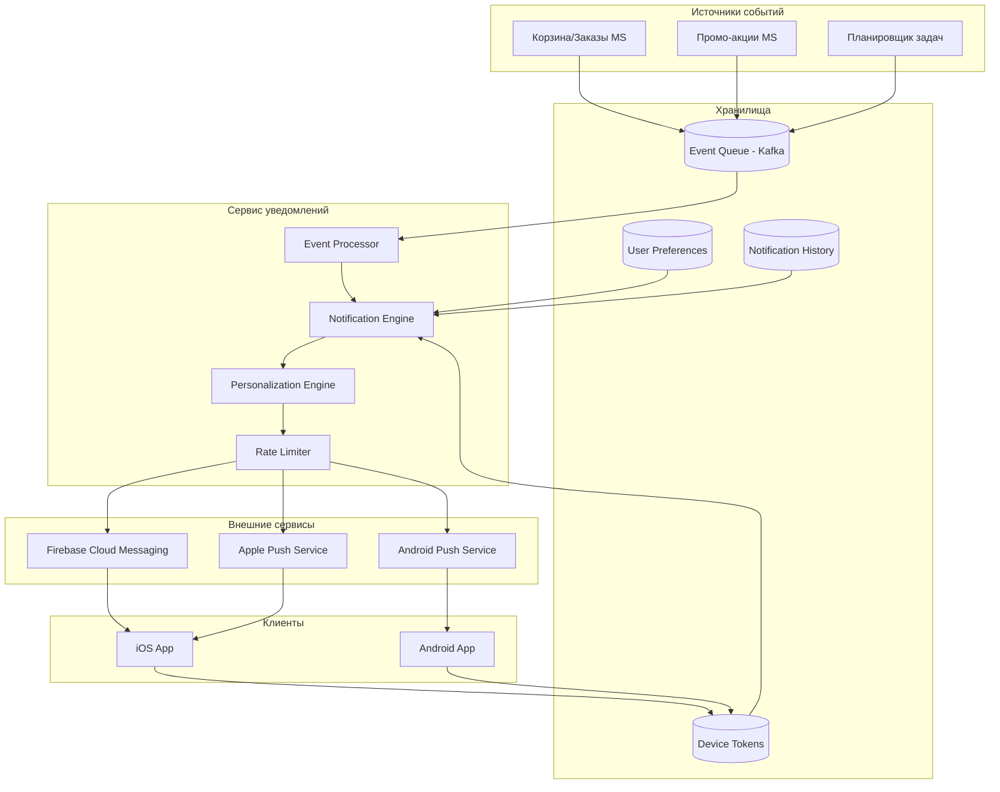

# Задание 3: Архитектура системы PUSH-уведомлений

## 📋 Обзор требований
**Цель:** Разработать архитектуру системы отправки PUSH-уведомлений для мобильного приложения интернет-магазина "Петрушка Зеленая".

**Типы уведомлений:**
1. **Оповещения о корзине** - заказ долго лежит без действий
2. **Статусы заказов** - подтверждение, отмена, доставка
3. **Рекламные рассылки** - акции, скидки, новинки
4. **Персонализированные уведомления** - рекомендации, напоминания

## 🏗️ Архитектурная схема


## 🔧 Ключевые компоненты

### **1. Сервис уведомлений (Notification Service)**
- **Event Processor** - обработка входящих событий
- **Notification Engine** - генерация уведомлений по шаблонам
- **Personalization Engine** - персонализация контента
- **Rate Limiter** - ограничение частоты отправки

### **2. Внешние сервисы доставки**
- **Firebase Cloud Messaging (FCM)** - для Android и iOS
- **Apple Push Notification Service (APNS)** - для iOS
- **Web Push API** - для веб-версии

### **3. Хранилища данных**
- **Device Tokens DB** - токены устройств пользователей
- **User Preferences DB** - настройки уведомлений
- **Notification History DB** - история отправленных уведомлений
- **Event Queue (Kafka)** - очередь событий для асинхронной обработки

## 📊 Поток данных

```plaintext
1. Событие (брошенная корзина) → Kafka
2. Kafka → Event Processor → Валидация
3. Event Processor → Notification Engine → Генерация
4. Notification Engine → Personalization Engine → Персонализация
5. Personalization Engine → Rate Limiter → Проверка лимитов
6. Rate Limiter → FCM/APNS → Доставка
7. Push Service → Мобильное устройство → Получение
```
## ⚙️ Пример API Endpoints

### **Регистрация устройства:**
```http
POST /api/v1/devices/register
Content-Type: application/json
Authorization: Bearer {token}

{
  "device_id": "device_123",
  "platform": "ios",
  "push_token": "fcm_token_abc",
  "app_version": "2.5.0"
}
```
### **Отправка уведомления (внутренний API):**
```http
POST /api/v1/internal/notifications/send
Content-Type: application/json

{
  "event_type": "abandoned_cart",
  "user_id": "user_123",
  "data": {
    "cart_id": "cart_456",
    "item_count": 3,
    "total_amount": 1500
  }
}
```
## 🛡️ Безопасность и комплаенс

### **GDPR/согласие пользователя:**
- Явное согласие при установке приложения
- Возможность отписаться в настройках
- Хранение токенов в зашифрованном виде

### **Защита от злоупотреблений:**
- Rate limiting (макс. 5 уведомлений в час на пользователя)
- Валидация источников событий
- Мониторинг аномальной активности

## 📈 Метрики успеха

| Метрика | Целевое значение |
|---------|------------------|
| Доставка | >95% |
| Открытия | >30% |
| Конверсия | >5% |
| Отказы | <10% |
